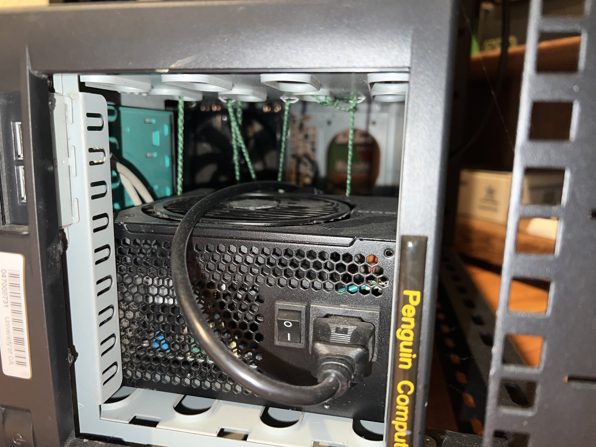
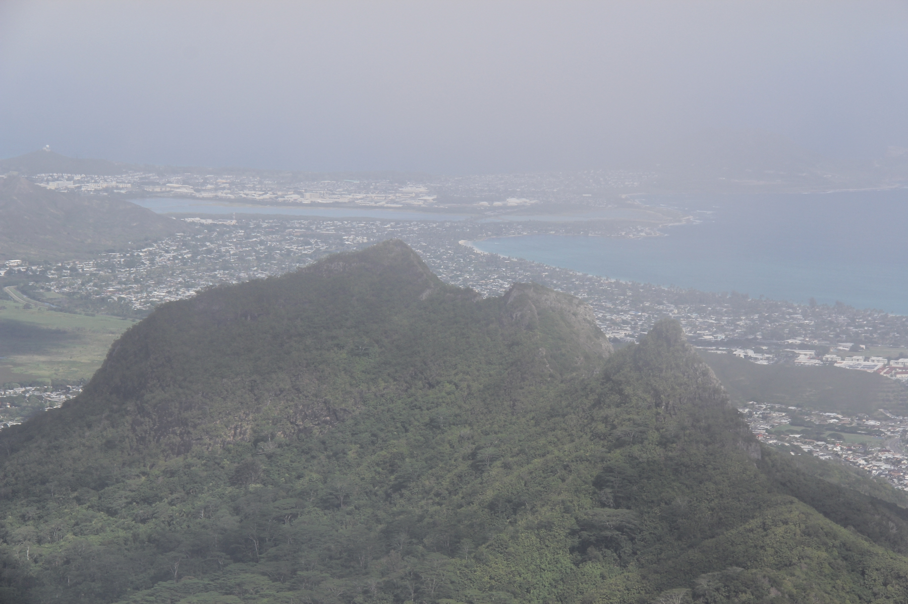

PWS is the codename for my homelabbing project, a pursuit that has taught me much about system maintenance, networking, and security practices. As you might be able to tell, its name is a parody of the much more famous AWS (Amazon Web Services) moniker. I use my home infrastructure to host my side projects, manage IOT devices, and try out the open source software flavor of the week.

The v1 implementation of PWS was named Whitney, after the mountain in California. The original hardware was sourced from my old desktop PC, which was made completely of hand-me-down parts, and was housed in an old server case that was e-wasted by my college. This initial build was definitely on the "janky" side, featuring an unmounted power supply in the optical bay, secured only by some green yarn. (Fire hazard, anyone?)

Olomana, the web server, is a significant upgrade over its predecessor. It was reincarnated as a 4U rack-mounted machine with modern components, now mounted in a modest 16U rack. It currently is neighbors to my Raspberry PI cluster, and basic infrastructure (UPS and backup mesh network). Critical resources like memory and CPU cores were prioritized for this build, and I configured a resilient ZFS raidz1 cluster for redundancy against the power outages in my area that have in one instance corrupted a data drive on the original PWS build. 

I continue with my theme of naming my PWS infrastructure after mountains, with this iteration being named after [Mount Olomana](https://en.wikipedia.org/wiki/Olomana_(mountain)), a three-peaked mountain near where my family lives on Oahu. 

With global supply chain shortages impacting the availability of GPUs at the time, this machine does its GPU compatible work on my old desktop graphics card. It's enough to self host smaller open source AI models but is a pain point I look to correct next. On the other hand, the memory upgrades prededed a global RAM availability crisis, so there is a bright side to look on.

I am extatic for the rebuild, and for the freedom of education it has granted me. Those who share my passion for experimenting for tech should jump in and give homelabbing a try for themselves.

See more on [Github](https://github.com/runyanjake/olomana).
