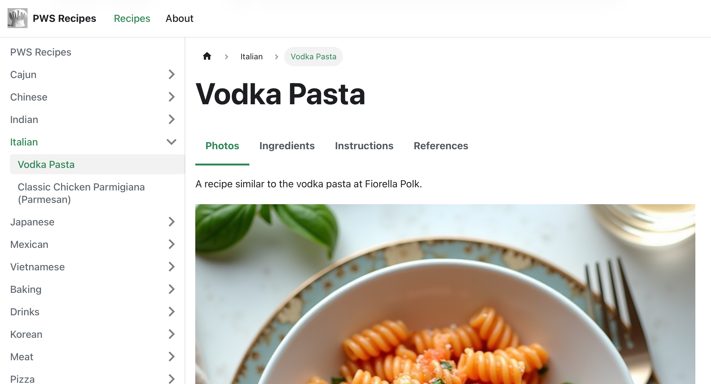
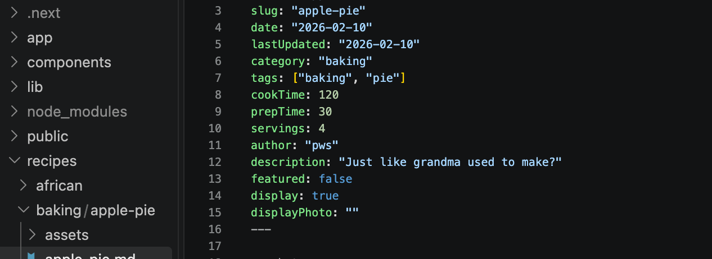
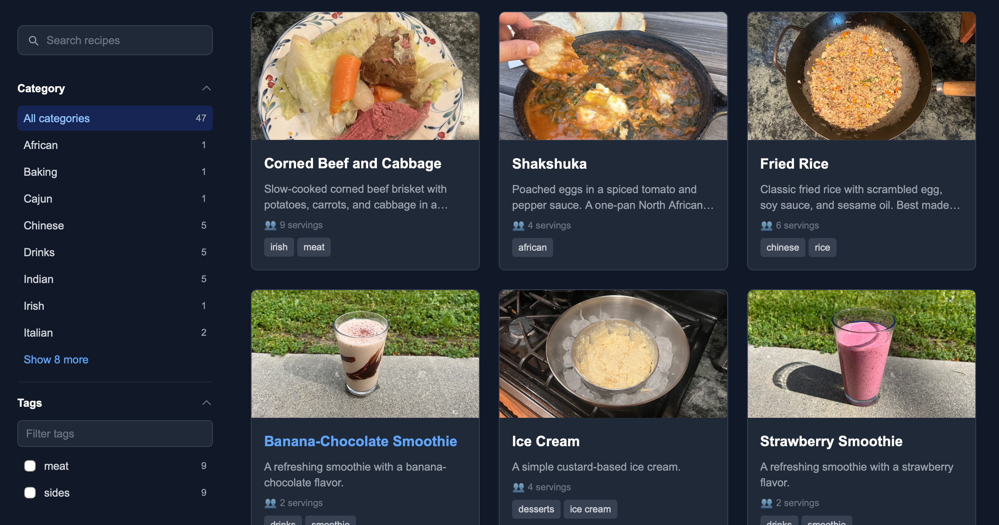

The biggest pain point I've felt when trying a new recipe is navigating the recipe page. So many Squ*respace-templated websites appear to have turned the advertising knob to 11 *(completely understandable btw, money is money)*, at the expense of user experience and information density. 

Many times I'll have the recipe open on a mobile device as I cook, and while measuring ingredients for the next step, I'll come back to the recipe to figure out the amounts when I realize the website has scrolled back up to the top of the page. From there, I'll scroll for about 15 seconds to find the recipe card again, as my pot goes a bit too far and burns on the stove.

This site was built to share recipes in an information-forward way, while implementing good UI practices and ethical ad serving (though it is ad free for now).

## A Quick Start
My north star for this website was to make it content focused. I am not a web developer by trade, but found through building other websites like the original PWS homepage, that the 90-10 rule is more apparent in web dev than I've seen it anywhere. As a backend developer, writing a folder of markdown and using it to furnish a site was a very exciting idea.

During my tooling research for this website, I found Meta Open Source's documentation framework [Docusaurus](https://docusaurus.io), and quickly decided on it as a way to bootstrap my site. I deployed it on PWS, and used it for years. 

## And a Better Way
After a while of using Docusaurus and customizing my site from within the framework, I became frustrated with the hierarchical nature of the framework, and needing to organize under a top level `docs/` folder. I figured out how to create sister folder structures to Docs and link to them from around the site, but it didn't feel first party. From here I knew I wnated to do a rewrite. 

I wanted to make a tool that kept my creative freedom open, and was purely controlled via markdown so I could edit from a high level. Armed with the latest AI tooling, I began work and built a simple rendering framework that operated off of a top level `recipes/` directory, using YAML frontmatter slapped onto a standard Markdown file. I used the frontmatter to save metadata about files, from recipe tags to their sidebar ordering while the rendering framework parsed special markdown headings into the recipe card tabs you see on the website today. 

The site has gone through multiple look-and-feel changes over the years, with some features like exportable/printable display cards coming and going, but the website is in a good state now. With the growing number of recipe cards, I am making more use of the filter and search features I've built in, and as the project matures I continue to look more at UI and discoverability features, both for the website and for the individal recipes inside it. 

Cooking is a lot of fun, and maintaining this website has helped me keep that feeling alive.