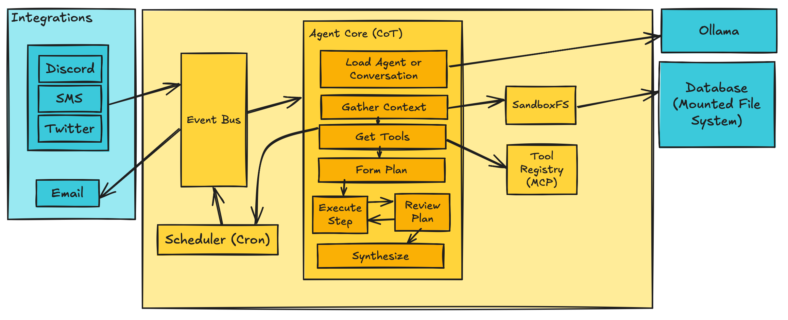

This is our old family cat, Tobee. Isn't he cute?

Tobee was known around my childhood neighborhood as one of the friendliest cats around - since we adopted him in 2010, he exhibited a great interest in people, strangers, and everything that moved near him. We loved him very much.

I started this agent framework project during a time when I was missing him, so this project became a fun way to eternalize him in my mind, while of course learning about agent framework.

## System Architecture

Tobee was first designed with a Chain-of-Thought ([CoT](https://arxiv.org/abs/2201.11903)) model, which was popular at the inception of this project. Since then, with the emergence of more thought-based models entering the local LLM community space, the project has moved toward a Plan-and-Execute ([Link](https://arxiv.org/abs/2502.01390)) model, which is what serves it today.

Through these iterations I've wanted to keep the agent model as plug-and-play as I can, so that this project could allow me to try out frontier model thought patterns, like Reason-Without-Observation ([Rewoo](https://www.alphaxiv.org/abs/2305.18323)) or a full multi agent orchestration (which may be limited by GPU compute availability on my machines).

## Integrations
It quickly became apparent with this project (and other timely releases like [Openclaw](https://openclaw.ai)) that the meat and potatoes of an assistant AI is in the integrations that you can build and support.

I follow industry standards here and define a tool registry that allows us to register tools using the Model Context Protocol ([MCP Spec](https://modelcontextprotocol.io/specification/2026-07-28)) to hopefully allow Tobee to support integrations that I didn't write in the future.

## Tools
One interesting bump in the road that I've hit is figuring out how to conceptually distance Integrations from Tools. In my mind, tools are first party, as they are at the system level. the MCP spec agrees on this, tying tools to the agent runtime.

But to myself, the tendency of wrapping such tools in the MCP spec seems like we are blurring the lines between Integration and Tool. However, I'll concede that when the goal is decoupling agent architecture from its abilities the implementation practice seems fine.

## Next Steps
The future of Tobee is to chase agent architecture trends, and follow local LLM releases, while I wait to find a listing for a modern GPU that won't break the bank.

Curious about Tobee's development? Check out the Github [repo](https://github.com/runyanjake/tobee).